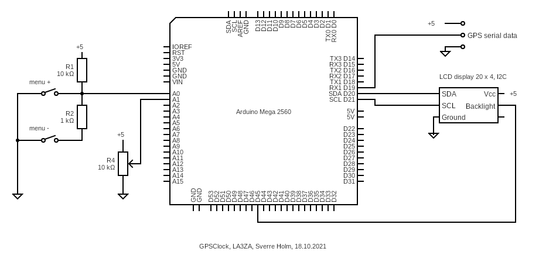

# Multi Face GPS clock for the Arduino Mega

This is an Arduino Mega with 20 x 4 LCD taking data from a GPS, here showing local and UTC time. 

Blog post with documentation of hardware and some 22 different screens showing solar and lunar position, their rise and set times, moon phase, date for Easter Sunday in Gregorian and Julian calendars and more: 
* Multi Face GPS Clock published, 29.09.2021, https://la3za.blogspot.com/2021/09/gps-clock.html
* Updated Arduino Multi Face GPS Clock, 26.10.2021, https://la3za.blogspot.com/2021/10/updated-gpsclock.html

Blog posts detailing the development:
* Finally figured out the moon,  23.08.2021, https://la3za.blogspot.com/2021/08/finally-figured-out-moon.html
* GPS Clock with Binary Display, 27.04.2020, https://la3za.blogspot.com/2020/04/gps-clock-with-binary-display.html
* Yet another Arduino GPS clock,  6.11.2016, https://la3za.blogspot.com/2016/11/yet-another-arduino-clock.html

Hardware schematic, first version: 

The two push buttons control whether the screen number increases or decreases by one. The pot controls the backlight of the LCD. These are the features supported in version 1.03 of the code.

Starting with version 1.10, a rotary encoder with a push button is also supported, in addition to the separate push buttons and the pot of the original code. In order not to clutter the schematic too much, only the rotary encoder is shown in the following schematic. Here the rotary encoder selects screen number. A push on the button lets the rotary encoder control the backlight. In the schematic however, the backlight is controlled directly by a separate trim pot and not by software. In that case, a push on the rotary encoder lets one toggle back and forth to a user-selectable favorite screen. 

Hardware schematic, second version: 

The code starts default with 
* Central European Time for the local time zone
* European date format, dd.mm.yyyy
* All day names, full and abbreviated, are in English
* GPS baud rate is 9600

See [wiki](https://github.com/la3za/Multi-Face-GPS-Clock/wiki) for more details on hardware and software setup.
