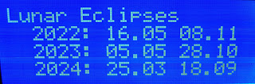

# Multi Face GPS clock for the Arduino Mega

The purpose of this project is to make available as many clock and clock related functions as possible given the constraint of a 20 x 4 LCD. The number of different screens are now more than thirty. Some are useful, some are very specialized, and some are somewhat weird. All the screens have been laid out with a view to good esthetics and easy readability.

The clock is based on an Arduino Mega taking time and position data from a GPS. Below it shows local time and UTC time. 

The LA3ZA blog has posts with documentation of hardware and the different screens showing solar and lunar position, their rise and set times, moon phase, date for Easter Sunday in Gregorian and Julian calendars and much more. See keyword "Arduino clock", https://la3za.blogspot.com/search/label/Arduino%20clock, starting with early development in 2016 up to the present. 

Here are more examples:

Hardware schematic, first version (supported from v1.0.0): 

The two push buttons control whether the screen number increases or decreases by one. The pot controls the backlight of the LCD. These are the features supported from v1.0.0 to v1.0.4 of the code.

Starting with version 1.1.0, a rotary encoder with a push button is also supported, in addition to the separate push buttons and the pot of the original code. In order not to clutter the schematic too much, only the rotary encoder is shown in the following schematic. Here the rotary encoder selects screen number. A push on the button lets the rotary encoder control the backlight. In the schematic however, the backlight is controlled directly by a separate trim pot and not by software. In that case, a push on the rotary encoder lets one toggle back and forth to a user-selectable favorite screen. 

Hardware schematic, second version (supported from v1.1.0): 

The code starts default with 
* Central European Time for the local time zone
* European date format, dd.mm.yyyy
* All day names, full and abbreviated, are in English
* GPS baud rate is 9600

See [wiki](https://github.com/la3za/Multi-Face-GPS-Clock/wiki) for more details on hardware and software setup.

Note new version numbering which follows the semantic versioning standard. Thus previous versions v1.01, 1.02, 1.03, 1.04, 1.10 are now v1.0.1, 1.0.2, 1.0.3, 1.0.4, and v1.1.0 and so on.

